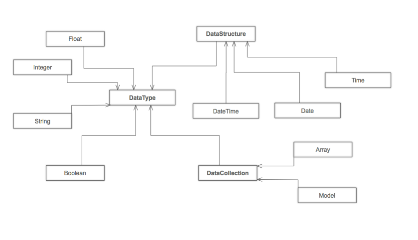

==============
Types & Models
==============

Models allow you to define rules for your API's data. prestans uses these rules to ensure the integrity of the data exchanged between the client and the server. If you've' used the `Django <http://djangoproject.com>`_ or `Google AppEngine <https://developers.google.com/appengine/>`_ prestans models will look very familiar. prestans models are *not* persistent.

prestans types are one of the following:

* ``prestans.types.DataType`` all prestans types are a subclass of ``DataType``, this is the most basic DataType in the prestans world.
* ``prestans.types.DateStructure`` are a subclass of ``DataType`` but represent complex types like Date Time.
* ``prestans.types.DateCollection`` are a subclass of ``DataType`` and represent collections like Arrays or Dictionaries (refered to as Models in the prestans world).

Each type has configurable properties that prestans uses to validate data. It's important to design your models with the strictest case in mind. Use request and response filters to relax the rules for specific cases, refer to our chapter on :doc:`validation`.

This chapter introduces you to writing Models and using it in various parts of your prestans application. It is possible to write custom ``DataType``.

All prestans types are wrappers on Pythonic data types, that you get a chance to define strict rules for each attribute. These rules ensure that the data you exchange with a client is sane, ensures the integrity of your business logic and minimizes issues when persisting data. All of this happens even before your handler is even called.

*Most importantly* it cuts out the need for writing trivial boilerplate code to validate incoming and outgoing data. If your handler is called you can trust the data is sane and safe to use.

prestans types are divided into, *Basic Types*, and *Collections*, currently supported types are:

* ``String``, wraps a Python ``str``
* ``Integer``, wraps a Python number
* ``Float``, wraps a Python number
* ``Boolean``, wraps a Python ``bool``
* ``DataURLFile``, supports uploading files via HTML5 `FileReader <http://www.html5rocks.com/en/tutorials/file/dndfiles/>`_ API
* ``Date``, wraps Python ``date``
* ``Time``, wraps Python ``time``
* ``DateTime``, wraps Python ``datetime``
* ``Array``, wraps Python ``lists``
* ``Model``, wraps Python ``dict``

The second half of this chapter has a detailed reference of configuration parameters for each prestans ``DataType``.

Writing Models
==============

``Models`` are defined by extending ``prestans.types.Model``. Models contain attributes which either be a basic prestans type (a direct subclass of ``prestans.types.DataType``) or a reference to an instance of another Model, or an ``Array`` of objects.

The REST standard talks about URLs refering to entities, this is often interpreted literally as REST API URLs refer to persistent models. Your REST API is the *business logic* layer of your Web client / server application. Providing direct access to persistently stored data through your REST API is simply replicating XML-RPC and not only is it bad design in the RESTful world but also extremely insecure.

RESTful APIs should serve back REST models. REST models are views of your data, that make sense as a response to the REST request. It's important to understand this so you can define your REST models to be as strict as possible. Like all good business logic layers, a RESTful API should never accept a request it can't comply with, this includes authority to perform the requested tasks on the data.

Consider a scenario where we are trying to model discographies, where a ``Band`` has ``Albums``, has ``Tracks``.

Depending on the implementation of this applicaiton it might be easier to send down ``Tracks`` when a client requests ``Albums``, but might only want to send down ``Albums`` (without ``Tracks``) when a list of ``Bands`` is requested.

.. note:: Read our section of Design Notes, to learn more about designing better REST APIs.

General convention for prestans apps is to keep all your REST models in a single package. To start creating models, simply define a class that extends from ``prestans.types.Model``

.. code-block:: python

    ... amogst other things
    import prestans.types

    class Track(prestans.types.Model):

        ... next read about attributes here

Defining Attributes
-------------------

All atributes of a ``Model`` must be an instance of a ``prestans.type``, Attributes can also be relationships to instances or collections of Models.

Attributes are defined at a class level, these are the rules used by prestans for each instance attributes of your ``Model``. By default prestans is absolutely unforgiving and will ensure that each attribute satifies all it's conditions. Failure results in aborting the creation of an instance.

At the class level define attributes by instantiating prestans types with your rules, ensure they are as strict as possible, the more your define here the less you have to do in your handler. The objective is not to pass through data that your handler can't work with.

.. code-block:: python

    class Track(prestans.types.Model):

        id = prestans.types.Integer(required=False)
        name = prestans.types.String(required=True, min_length=1)
        duration = prestans.types.Float(required=True)

Our :ref:`type-config-reference` guide documents in detail configuration validation options provided by each prestans ``DataType``.

.. note:: prestans Models do not provide back references when defining relationships between Models (like many ORM layers), defining cross references in Models can cause an infinite recursion. REST models are views on your persistent data, in most cases cross references might mean re-thinking your API design. You can also use DataAdapters to prevent an infinite recursion.

To One Relationship
-------------------

One to One relationships are defined assigning an instance of an existing ``Model`` to an attribute of another.

Validation rules accepted as instantiation values are for the attribute of the container ``Model``, they are evaluated the same way as basic prestans ``DataTypes``.

.. code-block:: python

    class Band(prestans.types.Model):

        ... other attributes ...

        created_by = UserProfile(required=True)

On success the attribute will refer to an instance of the child ``Model``. Failure to validate attributes of the children result in the failure of the parent  ``Model``.

To Many Relationship (using Arrays)
-----------------------------------

prestans provides ``prestans.types.Array`` to provide lists of objects. Because REST end points refer to Entities, Collections in REST responses or requests must have elements of the same data type.

You must provide an instance prestans DataType (e.g Array of Strings for tagging) or defined Model as the ``element_template`` property of an ``Array``. Each instance in the ``Array`` must comply with the rules defined by the template. Failure to validate any instance in the ``Array``, results as a failure to validate the entire ``Array``.

.. code-block:: python

    class Album(prestans.types.Model):

        ... other attributes ...

        tracks = prestans.types.Array(element_template=Track(), min_length=1)

Arrays of Models are validated using the rules defined by each attribute. If you are creating an Array of a basic prestans type, the validation rules are defined in the instance provided as the ``element_template``:

.. code-block:: python

    class Album(prestans.types.Model):

        ... other attributes ...

        tags = prestans.types.Array(element_template=prestans.types.String(min_length=1, max_length=20))

Self References
---------------

Self references in prestans Model definition are the same as self referencing Python objects. 

.. code-block:: python

    ... amogst other things
    import prestans.types

    # Define the Model first
    class Genre(prestans.types.Model):

        id = prestans.types.Integer(required=False)
        name = prestans.types.String(required=True, min_length=1)
        year_started = prestans.types.Float(required=True)

        ... and other attributes

    # Once defined above you can self refer 
    Genre.parent = Genre(required=False)

Use arrays to make a list:

.. code-block:: python

    Genre.sub_genres = prestans.types.Array(element_template=Genre())

Special Types
=============

Apart the usual suspects (``String``, ``Integer``, ``Float``, ``Boolean``) prestans also provides a few complex ``DataTypes``. These are wrappers on data types that have extensive libraries both on browsers and the Python runtime, but are serialized as strings or numbers.

DateTime
--------

DateTime wraps around python ``datetime``, serialization formats like JSON serialize dates as strings, there are various standard formats for serializing dates as Strings, by default prestans ``DateTime`` uses :rfc:`822` expressed as ``%Y-%m-%d %H:%M:%S`` format string in Python. This is because Google Closure's `Date API <http://closure-library.googlecode.com/svn/docs/class_goog_date_DateTime.html>`_ conveniently provides ``goog.date.fromIsoString`` to parse these Strings.

To use another format string, override the ``format`` parameter when defining ``DateTime`` attributes.

.. code-block:: python

    class Album(prestans.types.Model):
        
        last_updated =  prestans.types.DateTime(default=prestans.types.CONSTANT.DATETIME_NOW)

Assigning python ``datetime`` instances as the default value for prestans ``DateTime`` attributes works on the server, our problem lies in auto-generating client side stub code.  The use of the constant ``prestans.types.CONSTANT.DATETIME_NOW`` instruct prestans to handle this properly.

DataURLFile
-----------

HTML5's `FileReader <http://www.html5rocks.com/en/tutorials/file/dndfiles/>`_ API is well supported by all modern browsers. Traditionally Web applications used multi part mime messages to upload files in a POST request. The ``FileReader`` API allows JavaScript to get access to local files and makes for a much nicer solution for file uploads via a REST API.

The FileReader API provides ``FileReader.readAsDataURL`` which reads the file using as `Data URL Scheme <http://en.wikipedia.org/wiki/Data_URI_scheme>`_, which essentially is a `Base64 <http://en.wikipedia.org/wiki/Base64>`_ encoded file with meta information.

.. code-block:: html

    <!-- Use of data URL to embed an image -->
    
    <!-- Courtesy Wikipedia -->

``prestans.types.DataURLFile`` decodes the file Data URL Scheme encoded file and give access to the content and meta information. If you are using a traditional Web server like Apache, ``DataURLFile`` provides a ``save`` method to write the uploaded contents out, if you are on a Cloud infrastructure e.g Google AppEngine, you can use the ``file_contents`` property to get the decoded file.

DataURLFile can restrict uploads based on mime types.

.. code-block:: python

    class Album(prestans.types.Model):
        
        ... other attributes
        album_art =  prestans.types.DataURLFile(allowed_mime_types=['image/jpeg', 'image/png', 'image/gif'])

Using Models to write Responses
===============================

REST APIs should validate any data being sent back down to clients. Your application's persistent layer can't always guarantee that stored data meets your business logic rules.

Models are a great way of constructing sound responses. They are also serializable by prestans. Your handlers can simply pass a collection (using Arrays) or instance of a Model and prestans will serialize the results.

.. code-block:: python

    class AlbumEntityHandler(prestans.handlers.RESTRequestHandler):

        def get(self, band_id, album_id):

            ... environment specific code to get an Album for the Band

            album = pdemo.rest.models.Album()
            album.name = persistent_album_object.name

            ... and so on until you copy all the values across

            self.response.http_status = prestans.rest.STATUS.OK
            self.response.body = album

From the above example it's clear that code to convert persistent objects into REST models becomes repetitive, and as a result error prone. prestans provides ``DataAdapters``, that automate the conversion of persistent models to REST models. Read about it in the :doc:`ext` chapter.

If you use Google's Closure Library for client side development, we provide a complete client side implementation of our types library to create and parse, requests and responses. Details available in the :doc:`client` section.

.. _type-config-reference:

Type Configuration Reference
============================

Basic prestans types extend from ``prestans.types.DataType``, these are the building blocks of all data represented in systems, e.g Strings, Numbers, Booleans, Date and Times.

Collections contain a series of attributes of both Basic and Collection types.

String
------

Strings are wrappers on Pythonic strings, the rules allow pattern matching and validation.

.. note:: Extends ``prestans.types.DataType``

* ``required`` flags if this is a mandatory field, accepts ``True`` or ``False`` and is set to ``True`` by default
* ``default`` specifies the value to be assigned to the attribute if one isn't provided on instantiation, this must be a String.
* ``min_length`` the minimum acceptable length of the String, if using the ``default`` parameter ensure it respects the length. 
* ``max_length`` the maximum acceptable length of the String, if using the ``default`` parameter ensure it respects the length.
* ``format`` a regular expression for custom validation of the String.
* ``choices`` a list of Strings that are acceptable values for the attribute.
* ``utf_encoding`` set to ``utf-8`` by default is the confiurable UTF encoding setting for the String.

Integer
-------

Integers are wrappers on Python numbers, limited to Integers. We distinguish between Integers and Floats because of formatting requirements.

.. note:: Extends ``prestans.types.DataType``

* ``required`` flags if this is a mandatory field, accepts ``True`` or ``False`` and is set to ``True`` by default
* ``default`` specifies the value to be assigned to the attribute if one isn't provided on instantiation, this must be a Integer.
* ``minimum`` the minimum acceptable value for the Integer, if using default ensure it's greater or equal to than the minimum.
* ``maximum`` the maximum acceptable value for the Integer, if using default ensure it's less or equal to than the maximum.
* ``choices`` a list of choices that the Integer value can be set to, if using default ensure the value is set to of the choices.

Float
-----

Floats are wrappers on Python numbers, expanded to Floats.

.. note:: Extends ``prestans.types.DataType``

* ``required`` flags if this is a mandatory field, accepts ``True`` or ``False`` and is set to ``True`` by default
* ``default`` specifies the value to be assigned to the attribute if one isn't provided on instantiation, this must be a Float.
* ``minimum`` the minimum acceptable value for the Float, if using default ensure it's greater or equal to than the minimum.
* ``maximum`` the maximum acceptable value for the Float, if using default ensure it's less or equal to than the maximum.
* ``choices`` a list of choices that the Float value can be set to, if using default ensure the value is set to of the choices.

Boolean
-------

Booleans are wrappers on Python ``bools``.

.. note:: Extends ``prestans.types.DataType``

* ``required`` flags if this is a mandatory field, accepts ``True`` or ``False`` and is set to ``True`` by default
* ``default`` specifies the value to be assigned to the attribute if one isn't provided on instantiation, this must be a Boolean.

DataURLFile
-----------

Supports uploading files using the HTML5 `FileReader <http://www.html5rocks.com/en/tutorials/file/dndfiles/>`_ API.

.. note:: Extends ``prestans.types.DataType``

* ``required`` flags if this is a mandatory field, accepts ``True`` or ``False`` and is set to ``True`` by default
* ``allowed_mime_types``

DateTime
--------

Date Time is a complex structure that parses strings to Python ``datetime`` and vice versa. Default string format is ``%Y-%m-%d %H:%M:%S`` to assist with parsing on the client side using Google Closure Library provided `DateTime <http://closure-library.googlecode.com/svn/docs/class_goog_date_DateTime.html>`_.

.. note:: Extends ``prestans.types.DataStructure``

* ``required`` flags if this is a mandatory field, accepts ``True`` or ``False`` and is set to ``True`` by default
* ``default`` specifies the value to be assigned to the attribute if one isn't provided on instantiation, this must be a date. prestans provides a constans ``prestans.types.CONSTRANT.DATETIME_NOW`` if you want to use the date / time of execusion.
* ``format`` default format  ``%Y-%m-%d %H:%M:%S``

Collections
===========

Collections are formalised representations to complex itterable data structures. prestans provides two Collections, Arrays and Models (dictionaries).

Array
-----

Arrays are collections of any prestans type. To ensure the integrity of RESTful responses, ``Array`` elements must always be of the same kind, this is defined by specifying an ``element_template``. prestans Arrays are itterable.

.. note:: Extends ``prestans.types.DataCollection``

* ``required`` flags if this is a mandatory field, accepts ``True`` or ``False`` and is set to ``True`` by default
* ``default`` a default object of type ``prestans.types.Array`` to be used if a value is not provided
* ``element_template`` a instance of a ``prestans.types`` subclass that's use to validate each element. prestans does not allow arrays of mixed types because it does not form valid URL responses.
* ``min_length`` minimum length of an array, if using default it must conform to this constraint
* ``max_length`` maximum length of an array, 

Model
-----

Models are wrapper on dictionaries, it provides a list of key, value pairs formalised as a Python ``class`` made up of any number of prestans ``DataType`` attributes. Models can have instances of other models or Arrays of Basic or Complex prestans types.

.. note:: Extends ``prestans.types.DataCollection``

* ``required`` flags if this is a mandatory field, accepts ``True`` or ``False`` and is set to ``True`` by default
* ``default`` a default model instance, this is useful when defining relationships

The following is a parallel argument:

* ``**kwargs`` a set of key value arguments, each one of these must be an acceptable value for instance variables, all defined validation rules apply.